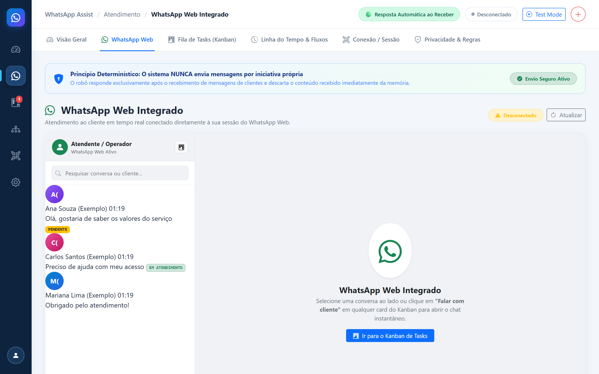
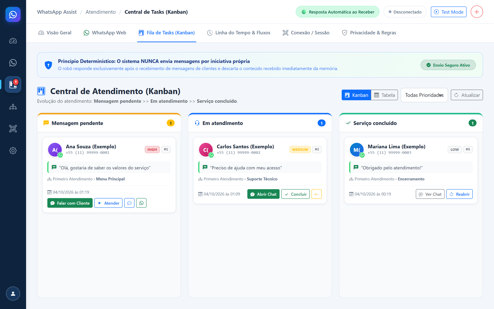
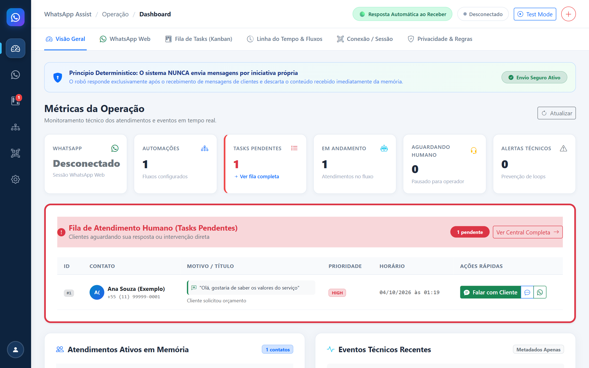
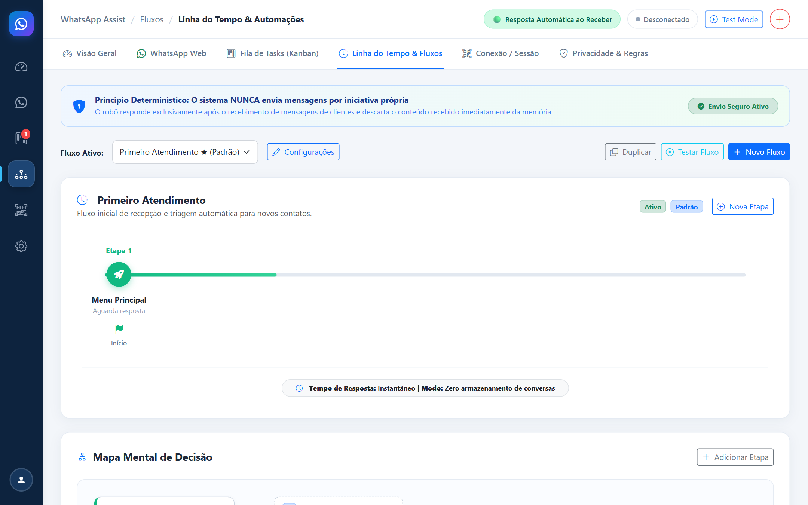
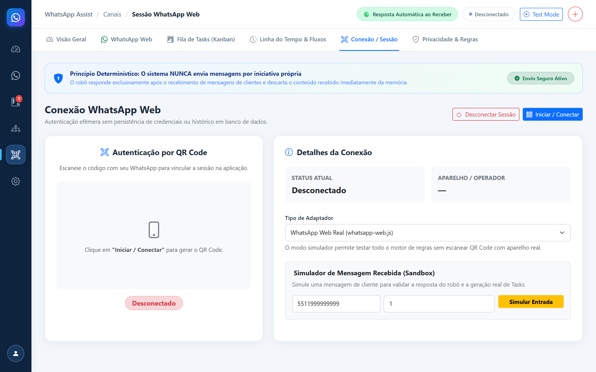
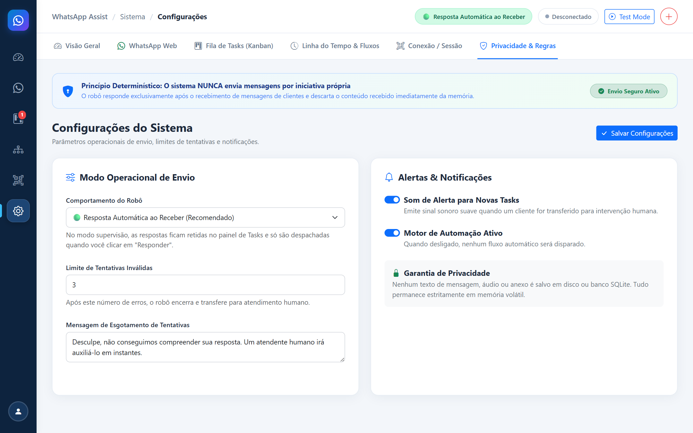

# 💬 WhatsApp Assist — Sistema WebApp de Primeiro Atendimento & WhatsApp Web Integrado

[](https://nodejs.org/)
[-blue.svg)](https://nodejs.org/api/sqlite.html)
[](https://getbootstrap.com/)
[](https://github.com/menezesjuan/WhatsApp_Assist)
[](#-princípios-de-privacidade--segurança)
[](LICENSE)

> Sistema web moderno, determinístico e de alta privacidade para gerenciamento de **primeiro contato** via WhatsApp Web. Automatiza a triagem inicial dos clientes através de regras configuráveis (menus, opções numéricas, palavras-chave), transfere o atendimento de forma segura para operadores humanos através de um **Quadro Kanban** visual e permite conversar diretamente com o cliente dentro do **WhatsApp Web Integrado**.

---

## 📑 Sumário

- [Visão Geral dos Módulos](#-visão-geral-dos-módulos)
  - [1. WhatsApp Web Integrado (Live Chat)](#1-whatsapp-web-integrado-live-chat)
  - [2. Central de Tasks & Quadro Kanban](#2-central-de-tasks--quadro-kanban)
  - [3. Dashboard Operacional em Tempo Real](#3-dashboard-operacional-em-tempo-real)
  - [4. Linha do Tempo & Motor de Automações](#4-linha-do-tempo--motor-de-automações)
  - [5. Conexão & Sessão do WhatsApp](#5-conexão--sessão-do-whatsapp)
  - [6. Configurações & Expediente](#6-configurações--expediente)
- [Princípios de Privacidade & Segurança](#-princípios-de-privacidade--segurança)
- [Passo a Passo para Instalação](#-passo-a-passo-para-instalação)
- [Tutorial Passo a Passo de Uso](#-tutorial-passo-a-passo-de-uso)
  - [Etapa 1: Conectando seu WhatsApp](#etapa-1-conectando-seu-whatsapp)
  - [Etapa 2: Configurando o Fluxo de Triagem](#etapa-2-configurando-o-fluxo-de-triagem)
  - [Etapa 3: Validando as Regras no Simulador](#etapa-3-validando-as-regras-no-simulador)
  - [Etapa 4: Gerenciando Atendimentos no Kanban](#etapa-4-gerenciando-atendimentos-no-kanban)
  - [Etapa 5: Conversando no WhatsApp Web Integrado](#etapa-5-conversando-no-whatsapp-web-integrado)
  - [Etapa 6: Finalizando o Atendimento](#etapa-6-finalizando-o-atendimento)
- [Estrutura do Projeto](#-estrutura-do-projeto)
- [Testes Automatizados](#-testes-automatizados)
- [Perguntas Frequentes & Resolução de Problemas](#-perguntas-frequentes--resolução-de-problemas)

---

## 📸 Visão Geral dos Módulos

### 1. WhatsApp Web Integrado (Live Chat)
Ambiente de chat em tempo real conectado diretamente à sessão do WhatsApp Web, sem necessidade de alternar abas ou sair do sistema. Permite ao operador visualizar fotos de perfil, histórico recente, balões de conversa e enviar mensagens com clique explícito.



* **Coluna da Esquerda:** Identificação do operador conectado, barra de pesquisa rápida por contato/conteúdo e lista dinâmica de conversas com foto, última mensagem e status.
* **Coluna da Direita:** Cabeçalho do cliente com telefone formatado, balões verdes (mensagens enviadas) e brancos (mensagens recebidas), botão para concluir atendimento e barra de texto para envio sob supervisão humana.

---

### 2. Central de Tasks & Quadro Kanban
Gestão visual de filas de atendimento organizada nas três etapas do ciclo de vida: **Mensagem pendente**, **Em atendimento** e **Serviço concluído**.



* **Cards Completos:** Cada card apresenta a foto do WhatsApp do cliente, nome, número formatado, tag de prioridade (`URGENT`, `HIGH`, `MEDIUM`, `LOW`), última mensagem recebida, etapa de origem e data/hora.
* **Ação Direta:** Botão **"Falar com Cliente"** que encaminha instantaneamente o operador para a conversa no chat integrado, pausando o robô de forma automática.
* **Drag-and-Drop:** Arraste e solte cards entre as colunas para atualizar o status do chamado em tempo real.

---

### 3. Dashboard Operacional em Tempo Real
Painel executivo com métricas de operação, fila de pendências urgentes e lista de contatos em atendimento ativo.



* **Métricas Principais:** Status da sessão do WhatsApp, Automações Ativas, Tasks Pendentes, Em Atendimento, Aguardando Humano e Falhas Registradas.
* **Supervisão Rápida:** Botão para alternar entre *Supervisão Total (Exige Clique)* e *Resposta Automática ao Receber*.
* **Fila de Atendimento:** Tabela de solicitações pendentes com atalhos diretos para atendimento.

---

### 4. Linha do Tempo & Motor de Automações
Construtor visual de fluxos de atendimento em árvore com linha do tempo interativa e simulador de teste de regras.



* **Etapas Determinísticas:** Cada etapa possui mensagem configurável, definição de criação de task humana e regras de ramificação.
* **Tipos de Matching:** Suporte a opções numéricas (`1, 2, 3`), palavras-chave flexíveis (`palavra1, palavra2`), correspondência exata, rótulo direto, qualquer texto (`ANY_TEXT`) e fallback vazio.
* **Simulador de Teste de Regras:** Teste como o motor reagirá a qualquer entrada do cliente antes de publicar alterações em produção.

---

### 5. Conexão & Sessão do WhatsApp
Gerenciamento simplificado de conectividade com autenticação segura por QR Code e suporte a sandbox de desenvolvimento.



* **QR Code Dinâmico:** Exibição com atualização automática de estado e desconexão controlada.
* **Modo Simulador / Sandbox:** Permite simular entrada de mensagens de clientes e testar todo o ecossistema sem necessitar de um aparelho celular real conectado.

---

### 6. Configurações & Expediente
Controle de parâmetros operacionais do sistema e políticas de segurança.



* **Modo Operacional:** Ajuste do comportamento do envio seguro.
* **Horário de Atendimento:** Definição de expediente (dias e horários comerciais) com mensagem automática de fora do expediente.
* **Limites de Segurança:** Configuração de transições máximas por sessão e timeouts de inatividade.

---

## 🔒 Princípios de Privacidade & Segurança

O WhatsApp Assist foi projetado com a filosofia **Privacy by Design**:

1. **Processar ➔ Decidir ➔ Descartar:** Mensagens de clientes são avaliadas em memória para identificar a regra de fluxo e imediatamente descartadas. Nenhuma mensagem ou mídia é armazenada no banco de dados.
2. **Sem IA Não-Determinística:** O sistema utiliza autômato finito de estados e expressões determinísticas, eliminando respostas incoerentes, alucinações e riscos de conformidade jurídica.
3. **Regra Absoluta "NUNCA ENVIA SOZINHO":** No atendimento humano, o sistema jamais dispara mensagens sem a autorização explícita do operador (clique no botão "Enviar" ou pressionar <kbd>Enter</kbd>).
4. **Proteção Anti-Loop e Idempotência:** Detecção de mensagens repetidas e proteção contra oscilações de fluxo infinitas ($A \leftrightarrow B$).

---

## 🚀 Passo a Passo para Instalação

### Pré-requisitos

Certifique-se de que sua máquina atende aos seguintes requisitos:

| Componente | Requisito | Notas |
| :--- | :--- | :--- |
| **Node.js** | Versão **20.x**, **22.x** ou superior | Testado e homologado com `node:sqlite` nativo |
| **NPM** | Versão 10.x ou superior | Incluso com o Node.js |
| **Navegador** | Google Chrome ou Microsoft Edge | Necessário para o Puppeteer executar o WhatsApp Web |
| **Sistema Operacional** | Windows 10/11, Linux (Ubuntu/Debian) ou macOS | Totalmente compatível |

---

### 1. Clonar o Repositório

Abra o terminal (Prompt de Comando, PowerShell ou Terminal Bash) e execute:

```bash
git clone https://github.com/menezesjuan/WhatsApp_Assist.git
cd WhatsApp_Assist
```

---

### 2. Instalar Dependências

Execute o comando de instalação para baixar todos os módulos necessários:

```bash
npm install
```

---

### 3. Iniciar a Aplicação

Inicie o servidor Express com o comando:

```bash
npm start
```

Você verá no terminal:

```text
[INFO] [WhatsAppManager] Initializing WhatsApp adapter: web
[INFO] [Server] Starting WhatsApp Assist WebApp system...
[INFO] [Database] Initializing SQLite database at: .../data/whatsapp_assist.sqlite
[INFO] [Database] Database migrations applied successfully.
[INFO] [Server] WhatsApp Assist WebApp is running at: http://localhost:3000
```

Abra o seu navegador e acesse: **[http://localhost:3000](http://localhost:3000)**.

---

### 4. Executar os Testes Automatizados (Opcional, Recomendado)

Para garantir que todos os 16 testes de pipeline, normalização, motor de regras e histórico de chat estejam 100% íntegros:

```bash
npm test
```

---

## 📖 Tutorial Passo a Passo de Uso

### Etapa 1: Conectando seu WhatsApp

1. No menu lateral ou na barra superior de abas, clique em **Sessão WhatsApp** (ou **WhatsApp**).
2. Verifique se o *Tipo de Adaptador* está configurado como **WhatsApp Web Real**.
3. Clique no botão azul **"Iniciar / Conectar"**.
4. O sistema iniciará a instância do navegador e exibirá o **QR Code** na tela.
5. No seu celular, abra o WhatsApp, vá em **Aparelhos conectados** ➔ **Conectar um aparelho** e aponte a câmera para o QR Code na tela.
6. Em poucos segundos, o selo mudará para **Conectado** em verde, exibindo o número do WhatsApp e nome do perfil.

> 💡 **Dica de Desenvolvimento:** Se quiser testar sem celular físico, mude o tipo de adaptador para **Modo Simulador / Sandbox**.

---

### Etapa 2: Configurando o Fluxo de Triagem

1. Clique na aba **Automações**.
2. O sistema já vem com um fluxo padrão configurado: **"Primeiro Atendimento"**.
3. Clique em **Editar Etapas / Regras** para abrir a árvore do fluxo:
   - **Etapa 1 (Menu Principal):** Contém a mensagem de boas-vindas e as opções numeradas (ex.: *1 - Orçamento*, *2 - Suporte*, *3 - Falar com Atendente*).
   - **Regras das Opções:** Cada opção aponta para uma próxima etapa ou para a criação de uma **Task Humana**.
4. Para criar uma nova etapa, clique em **Nova Etapa** e configure:
   - **Nome da etapa:** Ex.: *Coleta de Dados*.
   - **Mensagem automática:** Texto que o robô responderá (pode ser deixado em branco se for etapa de apenas aguardar o operador).
   - **Criar Task para Operador:** Marque como **Sim** para que o cliente caia no Kanban imediatamente.

---

### Etapa 3: Validando as Regras no Simulador

No painel de automações, você encontra o card **"Modo de Teste de Regras (Sandbox)"**:

1. Selecione a etapa que deseja testar (ex.: *Menu Principal*).
2. Digite uma mensagem de teste (ex.: `1`, `quero orcamento`, `gostaria de tirar uma duvida`).
3. Clique em **Simular Resposta**.
4. O sistema destacará qual regra fez o match, a justificativa técnica, qual seria a próxima etapa e a resposta enviada, permitindo refinar as palavras-chave sem riscos.

---

### Etapa 4: Gerenciando Atendimentos no Kanban

Quando um cliente escolhe uma opção que exige atendimento humano:

1. Uma notificação visual e sonora surge no canto inferior direito informando a criação da task.
2. Acesse a aba **Central de Tasks**.
3. O chamado aparecerá na coluna **Mensagem pendente** com a foto do WhatsApp do cliente, o telefone e a última mensagem recebida.
4. Você pode:
   - Arrastar o card para **Em atendimento** quando começar a atender.
   - Clicar no botão verde **"Falar com Cliente"**.

---

### Etapa 5: Conversando no WhatsApp Web Integrado

Ao clicar em **"Falar com Cliente"** no Kanban ou Dashboard:

1. A tela mudará imediatamente para a seção **WhatsApp Web Integrado**.
2. A task é automaticamente colocada em **Em atendimento**, e o robô tem a automação pausada para esse cliente (*handoff* seguro).
3. O histórico recente de mensagens do cliente é carregado na tela em balões organizados.
4. Digite a sua mensagem no campo inferior e aperte <kbd>Enter</kbd> ou clique no botão **"Enviar"**.
5. A mensagem é enviada instantaneamente pelo seu WhatsApp Web e registrada na conversa.

---

### Etapa 6: Finalizando o Atendimento

Quando terminar de falar com o cliente:

1. No topo da tela de chat, clique no botão verde **"Concluir Atendimento"** (ou arraste o card correspondente no Kanban para **Serviço concluído**).
2. O sistema encerra o chamado e atualiza as métricas operacionais no Dashboard.

---

## 📂 Estrutura do Projeto

```text
WhatsApp_Assist/
├── data/                               # Banco SQLite local (ignorado pelo git)
├── docs/                               # Documentação e capturas de tela
│   └── screenshots/
│       ├── 01-dashboard.png
│       ├── 02-kanban-tasks.png
│       ├── 03-chat-integrado.png
│       ├── 04-automacoes-fluxos.png
│       ├── 05-conexao-whatsapp.png
│       └── 06-configuracoes.png
├── scripts/
│   └── capture-screenshots.js          # Script automatizado de captura das telas
├── src/
│   ├── automation/                     # Núcleo de automação determinística
│   │   ├── ActionExecutor.js           # Despacho de mensagens e geração de tasks
│   │   ├── AutomationEngine.js         # Processador central de mensagens recebidas
│   │   ├── BusinessHoursChecker.js     # Validador de horário comercial
│   │   ├── InputNormalizer.js          # Sanitização e normalização de texto
│   │   ├── RuleEngine.js               # Avaliador de regras determinísticas
│   │   └── StateMachine.js             # Gerenciamento de sessões efêmeras
│   ├── backend/
│   │   ├── api/                        # Rotas REST (/whatsapp, /tasks, /automations, etc.)
│   │   └── server.js                   # Inicializador do Express e WebSocket
│   ├── config/                         # Parâmetros padrão e tempos de timeout
│   ├── database/                       # Camada SQLite com migrações automáticas
│   ├── notifications/                  # Emissor de eventos WebSocket em tempo real
│   ├── tasks/                          # Gestão de atendimentos humanos e Kanban
│   ├── utils/                          # Logger seguro, detector de loops e barramento
│   ├── whatsapp/                       # Adaptadores WhatsApp Web e Sandbox
│   │   ├── ChatHistoryManager.js       # Histórico em memória para o chat ao vivo
│   │   ├── MockWhatsAppAdapter.js      # Simulador para testes offline
│   │   ├── WhatsAppAdapter.js          # Contrato base da interface
│   │   ├── WhatsAppManager.js          # Gerenciador de conexão e alternância
│   │   └── WhatsAppWebAdapter.js       # Implementação real com whatsapp-web.js
│   └── frontend/                       # Interface do usuário (Single Page Application)
│       ├── css/                        # Estilos SaaS e Bootstrap 5
│       ├── js/                         # Controladores (api.js, ws.js, core.js, utils.js e um arquivo por tela: dashboard, chat, whatsapp, automations, tasks, settings; boot.js carrega por último)
│       └── index.html                  # Estrutura HTML da aplicação
├── test/                               # Suíte de testes automatizados
└── package.json                        # Metadados e dependências do projeto
```

---

## 🧪 Testes Automatizados

O sistema conta com 16 testes cobrindo todas as camadas críticas de negócio:

* **Pipeline E2E de Atendimento:** Validação de fluxo completo com entrada, triagem, geração de task e handoff humano.
* **Motor de Regras (`RuleEngine`):** Validação de opções numéricas, palavras-chave com acentuação/maiúsculas, emojis e opção `ANY_TEXT`.
* **Segurança e Idempotência:** Deduplicação de IDs de mensagens e prevenção de loops infinitos ($A \to B \to A \to B$).
* **Histórico do Live Chat:** Testes unitários do `ChatHistoryManager` e mesclagem de mensagens em memória.

Para executar os testes:

```bash
npm test
```

---

## ❓ Perguntas Frequentes & Resolução de Problemas

#### O WhatsApp desconectou inesperadamente. O que fazer?
Acesse a aba **Sessão WhatsApp**, clique em **Desconectar** e em seguida em **Iniciar / Conectar** para gerar um novo QR Code.

#### Minha mensagem não foi enviada no Live Chat.
Verifique no topo da tela do chat se o indicador exibe **WhatsApp Conectado**. Se o WhatsApp estiver desconectado, o sistema exibirá um aviso impedindo o disparo para evitar perdas.

#### O robô vai responder enquanto eu estiver falando com o cliente?
**Não.** Assim que o chamado entra em *Em atendimento* (ou quando o operador clica em "Falar com Cliente"), a máquina de estados pausa a automação do robô para aquele contato específico até que o atendimento seja concluído.

#### É possível alterar a porta padrão `3000`?
Sim. Você pode definir a variável de ambiente `PORT` antes de iniciar:
```bash
PORT=8080 npm start
```

---

## 📄 Licença

Este projeto é distribuído sob os termos da licença MIT. Consulte o arquivo `LICENSE` para obter mais informações.
